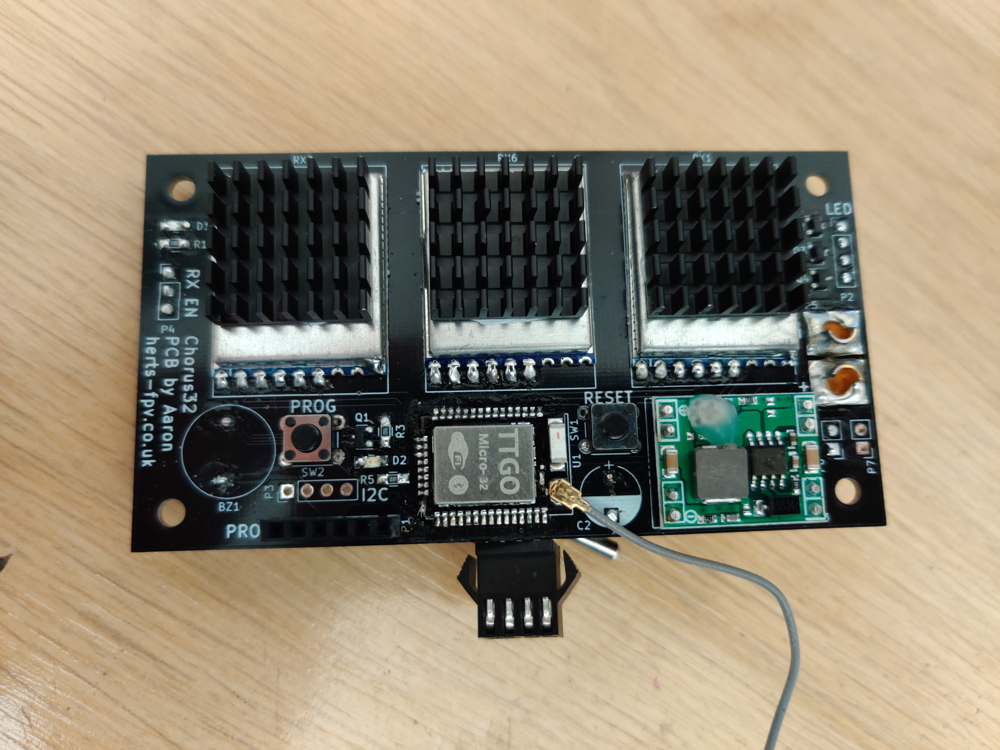
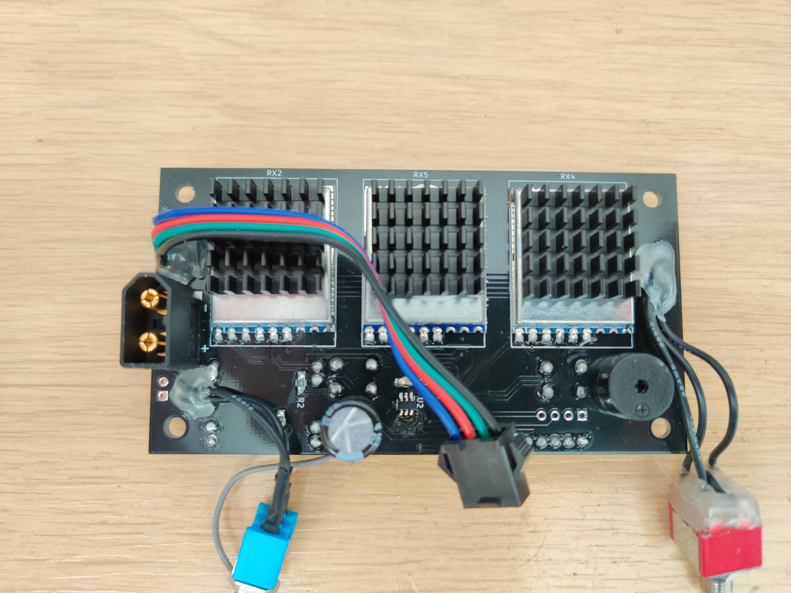
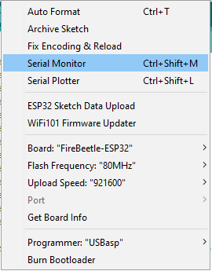

If you can't solder well this is not the lap timer for you. You will need to be able to drag solder or use paste and a heat gun, consult YouTube if unsure.

Features of this PCB:
* A smaller PCB size thanks to the micro ESP32
* An external antenna for extended range
* Modules can be turned off to save power
* Power monitoring on board with 6 nodes (no external modules required)
* Simplified power architecture

# Assembly
Buy the parts on the [BOM](bom.md) 

Assembly notes:
* Set the MP1584 voltage before soldering it to the PCB
* Hot glue over the potentiometer on th MP1584 will help stop it changing after being set
* Use the 2.54mm header pins to attach the MP1584
* Solder BZ1 and C2 to the oposite side of the PCB than indicated by the silk screen (observe the correct polarity)
* Drag solder the ESP32 and NLAS4599DTT1G
* Tack one corner of the ESP32 using solder and make sure the pin alignment is very good, don't rush this!
* Tack the other corner of the ESP32 before drag soldering
* Be sure to use a magnifier to inspect the pins once you have drag soldered and reflow as required (flux is your friend)
* Use a fat solder tip to drag solder mine is a 4mm chissel tip

**PCB Top Side**

**PCB Bottom Side**

# Programming
* Use the latest version of arduino IDE to program
* Instal the ESP32 boards using the board manager
* Instal all the custom libraries required
* Be sure to uncomment #define Micro32-PCB in the HardwareConfig.h file
* Use the below settings in arduino and select the correct COM port

* Remove the voltage select header from the FT232RL serial adaptor and connect it to the board and computer.
* Power the board using the XT60
* Hold down both the reset and prog buttons at the same time. release the reset button followed by the prog button
* Program the arduino and test

# Case

