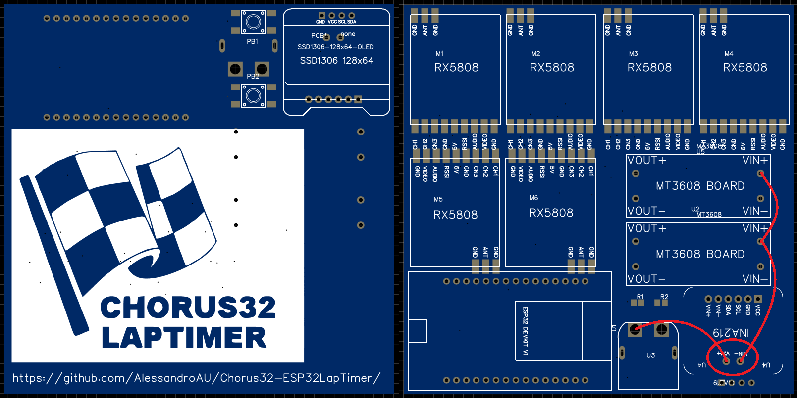

This PCB has been tested but found to have the INA219 Vin+ and Vin- pads reverse.  If you have ordered and plan to build with this PCB DO NOT SOLDER THESE PINS!.  Use patch wires as shown below.

Also note the Vcc GND pin order on the OLED.  There are 2 popular OLEDs available with these pins swapped!

