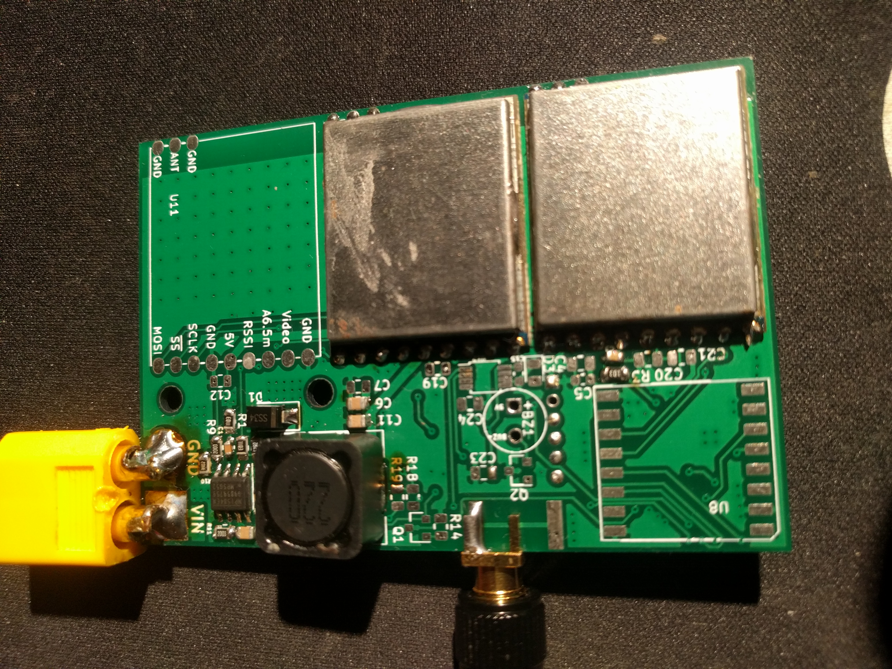
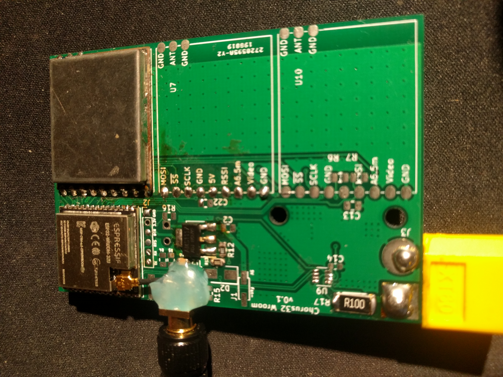

# Features
 - External edge mounted SMA connector for better range
   - Uses the esp32-wroom-32u
   - To connect the antenna, cut open a U.FL adapter cable and solder one end to the SMA connector
 - Integrated buck converter with correct components ;) (those modules from china are all over the place)
    - Max input 28V (26V if using ina219)
 - Footprint for an optional LoRa module
 - Space for 6 RX5808 modules
 - Optional ina219
    - I don't trust them anymore since one failed for me and put the input voltage on the 3.3V rail
    - Limits input voltage to 26V
 - Optional Fan with optional temperature sensor
 - Beeper

# Bugs
 - Wrong SMA footprint (still fits though)
 - Buzzer footprint is a little bit too small for my buzzers
 - A vertically mounted XT60 might be better

# Images

